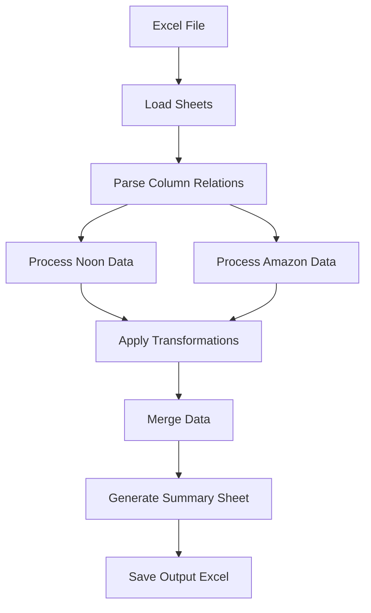

# Amazon & Noon Report Merger

Automated script to merge Amazon and Noon reports based on dynamic column mapping.

## Features

- **No Hardcoding** - Fully reusable script  
- **Dynamic Column Mapping** - Uses Column Relations Sheet for mapping  
- **Automatic Transformations** - Applies all transformation logic from Remarks  
- **Date Extraction** - Automatically extracts Day, Month, Year from dates  
- **Value Calculations** - Multiplies price × quantity where needed  
- **Source Tracking** - Identifies whether data came from Amazon or Noon

## Requirements

- Python 3.7+
- pandas
- openpyxl

## Installation

```bash
pip install -r requirements.txt
```

## Usage

### Auto-detect Excel file
```bash
python report_merger.py
```

### Specify file path
```bash
python report_merger.py "your_file.xlsx"
```

### Specify output path
```bash
python report_merger.py "input.xlsx" "output.xlsx"
```

## Excel File Structure

Your Excel file must contain these sheets:

1. **Amazon** - Amazon sales data
2. **Noon** - Noon sales data
3. **Column Relations Sheet** - Mapping configuration with columns:
   - `Summary Sheet - template column names`
   - `Noon KSA column name`
   - `Remarks` (for Noon transformations)
   - `Amazon KSA Column Name`
   - `Remarks` (for Amazon transformations)
4. **Summary Sheet - Template** (optional, will be generated)

## How It Works



### Processing Flow

1. **Load Sheets**
   - Reads Amazon, Noon, and Column Relations sheets
   - Validates data structure

2. **Parse Column Mapping**
   - Creates dynamic mapping dictionaries
   - Extracts transformation rules from Remarks

3. **Process Data**
   - Applies transformations to each row
   - Handles date extraction, calculations, and conditional logic
   - Adds source tracking

4. **Merge & Save**
   - Combines Amazon and Noon data
   - Generates Summary Sheet
   - Saves to new Excel file with all original sheets

## Transformation Rules Supported

The script automatically handles these transformations from the Remarks column:

- **Date Components**: Extracts day, month, or year from dates
- **Mark as NA**: Sets value to "NA" when specified
- **Multiplication**: Multiplies price × quantity for total value
- **Conditional Logic**: Handles contract/channel-specific rules

## Output

The script creates a new Excel file with the suffix `_MERGED.xlsx` containing:
- **Summary Sheet** - Merged and transformed data
- **Amazon** - Original Amazon data
- **Noon** - Original Noon data
- **Column Relations Sheet** - Original mapping configuration

## Example

```bash
# Input: Assignments-Sheet Automation.xlsx
python report_merger.py "Assignments-Sheet Automation.xlsx"

# Output: Assignments-Sheet Automation_MERGED.xlsx
```

## Notes

- The script preserves all original data
- Source column indicates whether each row came from Amazon or Noon
- All transformations are applied automatically based on Remarks
- The script is fully reusable for different Excel files with the same structure
 